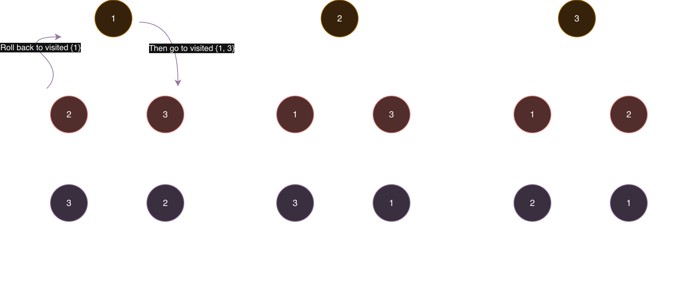

# 46. Permutations


## Line of thought
這題的核心思路，在於如何判斷決策樹裡的點是否走過，因此我們需要維護一個 Visited set, 快速的去查找是否已經走過這個點。
而每一個路徑必須要有一個回頭的概念。讓我們可以回到上一個 Node 繼續做其他的選擇 (這時因為 for loop 的關係，之前已經跑過的選擇會自然被踢除). 


## Solution 1. 寫出回頭的動作
```python
class Solution:
    def permute(self, nums: List[int]) -> List[List[int]]:
        results = []
        n = len(nums)
        visited = set()
        def dfs(state):
            if len(visited) == n:
                results.append(state.copy())
                return 

            
            for i in range(n):                    
                if nums[i] not in visited:
                    state.append(nums[i])
                    visited.add(nums[i])

                    dfs(state)

                    # roll back
                    state.pop()
                    visited.remove(nums[i])


        dfs([])

        return results
```

## Solution 2. 隱性回頭的動作
```python
class Solution:
    def permute(self, nums: List[int]) -> List[List[int]]:
        results = []
        n = len(nums)

        # visited 也可以當作參數傳遞
        def dfs(state, visited):
            if len(state) == n:
                results.append(state) # 這裡不用 .copy() 了，因為 state 已經是副本
                return 

            for i in range(n):                    
                if nums[i] not in visited:
                    # 關鍵：
                    # 1. 傳入 state + [nums[i]] (一個新的 list)
                    # 2. 傳入 visited.union({nums[i]}) (一個新的 set)
                    
                    new_state = state + [nums[i]]
                    new_visited = visited.union({nums[i]})
                    dfs(new_state, new_visited)

                    # 這裡不需要 "roll back"
                    # 因為 state 和 visited 這兩個變數本身沒有被改變

        dfs([], set()) # 初始 state 和 visited

        return results
```


### Python Set Union vs Add
1.  **`visited.union({nums[i]})`**:

      * **創建一個新的集合 (set)。**
      * 這個新集合是 `visited` **和** `{nums[i]}` 的聯集。
      * **原始的 `visited` 集合完全不會被改變。**

2.  **`visited.add(nums[i])`**:

      * **在原始的 `visited` 集合上原地 (in-place) 修改。**
      * **不會創建任何新的集合。**
      * 這個函式本身回傳 `None`。

這就是為什麼在「傳入副本」的寫法中，我們不需要 `roll back` (回頭)：
