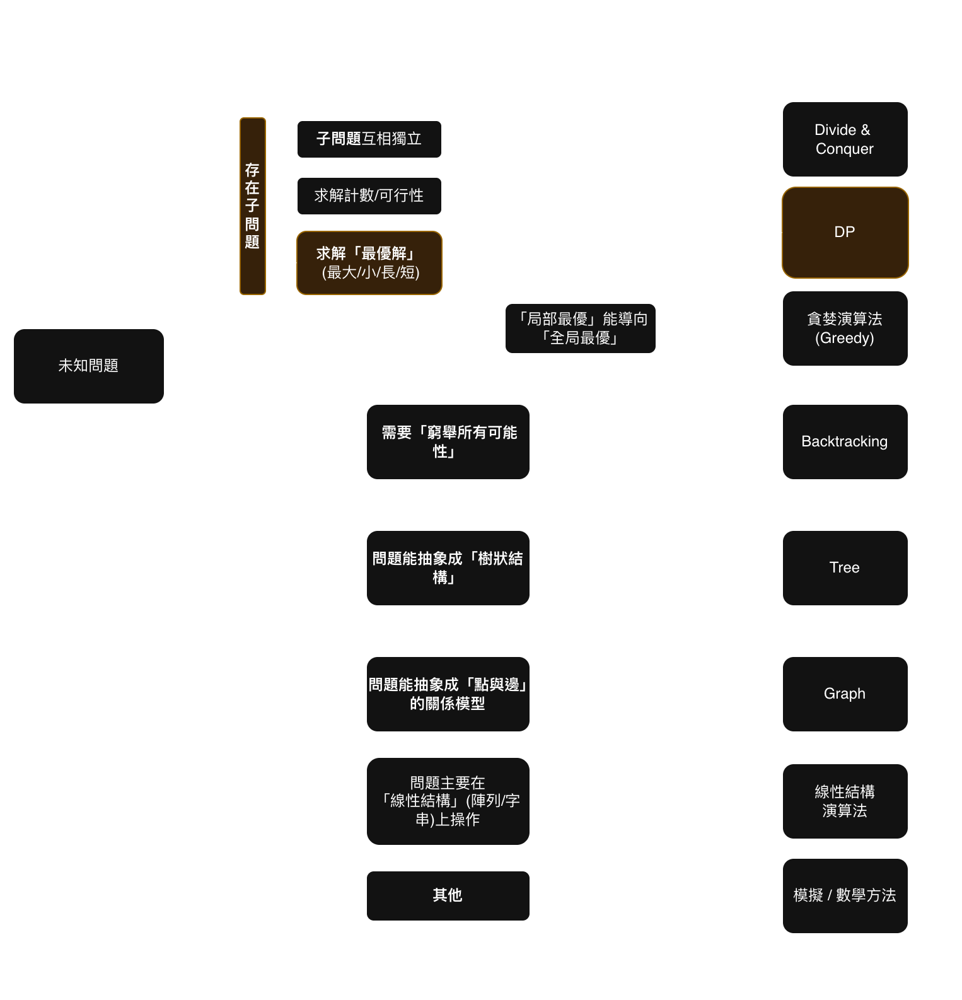
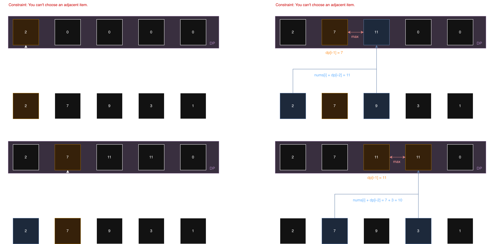

# 198\. House Robber

## Classify

決策之間存在互相依賴和限制條件，例如： 我不能同時搶 i 跟 i-1，這代表主問題可以視為子問題的組合。
而這題題目要求「回傳最大金額」，並且我們必須要依序對每一間房子做出一個決策： Rob or not.
最終的「最大金額」會是透過一系列的決策而累積而成。 因此我認為我們可以使用 DP 來解決此問題。
<details>
    <summary>English
    </summary>

The decisions involved are interdependent and have clear constraints. For instance, I can't rob house `i` and house `i-1` at the same time. This signals that the main problem can be viewed as a combination of subproblems.
The problem also asks for a maximum amount, and we have to make a sequential decision for each house: whether to rob it or not.
The final maximum amount is accumulated from this series of decisions. Therefore, I believe we can use Dynamic Programming to solve this problem.
</details>

## Line of thought

我們決定使用 DP 來解決此問題，因此我們需要定義這個 DP 裡面的資料要存什麼。
我會將這個 DP 用來儲存在當走到 i 位置的最優解，即在 i 位置所能搶劫的最大金額。
因此我們會先根據輸入 `nums` 的長度建立一個 DP 陣列，所有的值初始化為 0.

而已知我們不能同時搶劫 i 跟 i-1 的房子，因此 i = 0 與 i = 1 時的 dp 值也必要進行手動的初始化：
- 我們將 `dp[0]` 設為 `nums[0]`, 因為我們在 i = 0 時，只能搶該位置的金額，且不受其他位置影響
- 接著我們走到 `i = 1` 的位置，我們需要看 i = 0 與 i = 1 哪一個大，來決定我們是搶第 0 個位置還是第 1 個位置

這樣子我們完成了 DP 的初始化，我們需要開始處理遍歷 `nums` 計算每個位置的最大值：
- 因為 position 0 跟 1 都已經走過了，因此我們的遍歷從 position 2 開始: `for i in range(2, n)`
- 要能搶劫 `i` 位置，代表上一個搶劫的房子絕對不是 `i-1`, 因此在如果要搶 `i` 位置，他可能的最大金額會是 `nums[i]+dp[i-2]`
- 而我們需要判斷是否要搶 `i` 位置這個動作，決定方式是看「搶`i`位置」或「不搶`i`，搶`i-1`」，哪個可以得到最大金額，因此我們需要比較 `max(nums[i] + dp[i-2], dp[i-1])`

這樣我們就可以成功建立 DP 儲存每個位置可能搶到的最大值，最後我們只要回傳 dp 最後一個位置的值就是正確答案。


<details>
    <summary>English</summary>


So we're using Dynamic Programming. The first step is to **define our DP state**.

I'll define `dp[i]` as the **maximum amount of money we can rob *up to and including* house `i`**.
Based on this, we'll create a DP array with the same length as the `nums` input, and initialize all values to 0.

Now, we know we can't rob adjacent houses. This means our recurrence relation will look back two steps, so we need to **manually initialize our base cases** for `i=0` and `i=1`.

* We'll set `dp[0]` to `nums[0]`. This is because at the first house, our only choice is to rob it, and it's not affected by any previous houses.
* Next, when we get to `i=1` (the second house), we have to decide: is it better to rob house 0 (`nums[0]`) or house 1 (`nums[1]`)? We take the max of the two, so `dp[1] = max(nums[0], nums[1])`.

So our initialization is done. Now we need to iterate through the rest of `nums` to calculate the max value for each position.

* Since we've already handled positions 0 and 1, our loop will **start from position 2**: `for i in range(2, n)`.
* At any house `i`, we have two choices:
    1.  **We rob house `i`**: If we do this, we *cannot* have robbed `i-1`. This means our total money will be `nums[i]` plus the maximum we had up to house `i-2`, which is `dp[i-2]`.
    2.  **We *don't* rob house `i`**: If we skip this house, our maximum money is simply whatever maximum we had at the previous house, `i-1`, which is `dp[i-1]`.
* We want the best of these two choices, so our **recurrence relation** is:
    `dp[i] = max(nums[i] + dp[i-2], dp[i-1])`

After this loop finishes, the DP array will be filled, and our final answer is simply the last value in the array, `dp[n-1]`.
</details>


## Solutions
### 1\. Time: O(N) Space: O(N)
```python
class Solution:
    def rob(self, nums: List[int]) -> int:  
        n = len(nums)        

        if n == 0:
            return 0
                
        if n == 1:
            return nums[0]
        
        # 建立 DP 陣列
        dp = [0] * n    
        dp[0] = nums[0]                
        dp[1] = max(nums[0], nums[1])

        for i in range(2, n):        
            dp[i] = max(nums[i] + dp[i-2], dp[i-1])

        return dp[n-1]
```

### 2\. Time: O(N) Space: O(1)

關鍵觀察： 在 $O(N)$ 空間的解法中，我們發現在計算 `dp[i]` 時，我們只需要 `dp[i-1]` 和 `dp[i-2]` 這兩個值。這意味著我們根本不需要儲存一個完整的 dp 陣列。我們只需要兩個變數來「滾動」儲存前兩個狀態。

```python
class Solution:
    # T: O(N), S: O(1)
    def rob(self, nums: List[int]) -> int:
        n = len(nums)        

        # 邊界條件
        if n == 0:
            return 0
                
        if n == 1:
            return nums[0]
        
        # 建立兩個變數來取代 DP 陣列
        # second 代表 dp[i-2] 前前一個
        # first 代表 dp[i-1] 前一個
        
        # 初始化 (等同於 dp[0] 和 dp[1])
        second = nums[0]                
        first = max(nums[0], nums[1])
        
        # 迴圈從 i=2 開始
        for i in range(2, n):
            
            # 1. 計算 dp[i]
            #    current = max(nums[i] + dp[i-2], dp[i-1])
            current = max(nums[i] + second, first)
            
            # 2. 滾動更新變數，為下一次迴圈 (i+1) 做準備
            #    (新的 i-2) = (舊的 i-1)
            second = first
            #    (新的 i-1) = (剛剛算出的 dp[i])
            first = current
            
        # 迴圈結束時，first 儲存的就是 dp[n-1]
        return first
```