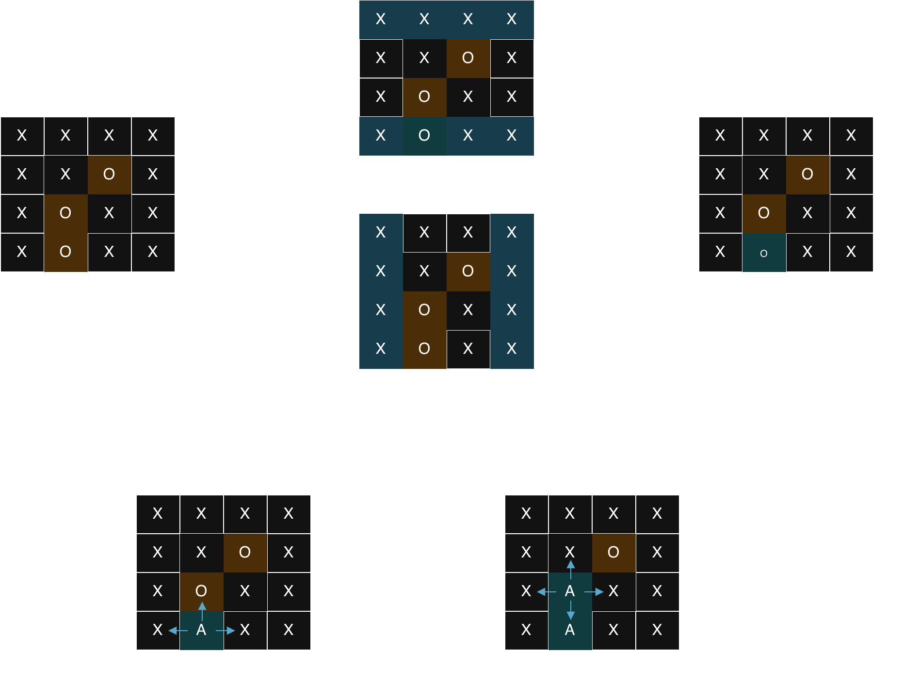

# 130. Surrounded Regions

[link](https://leetcode.com/problems/surrounded-regions/)

## Classify
這題同樣也是以 Matrix 為輸入，但本質上屬於 Graph Traversal 的題型。
具體來說，這是一個關於 **連通分量 (Connected Components)** 的問題，但有一個特殊的條件：我們只關心那些 **沒有** 連接到邊界的連通分量。

## Line of thought

這題的重點在於，要怎麼樣判斷哪些 'O' 是被 'X' 包圍的？
直觀的想法可能比較難實現，因為要判斷一個區域是否被包圍，需要檢查它四周是否都是 'X'，而且這個區域可能形狀很不規則。

**逆向思考 (Reverse Thinking)**：
與其找出哪些 'O' 被包圍，不如找出 **哪些 'O' 沒有被包圍**。
1. 任何連接到網格邊界 (Boundary) 的 'O'，一定不會被 'X' 包圍。
2. 與這些邊界上的 'O' 相連的所有 'O'，也都不會被包圍。

因此，我們的策略如下：
1. **標記安全區域**：遍歷網格的四條邊界。如果遇到 'O'，就從這個位置開始進行 DFS 或 BFS 遍歷，將所有相連的 'O' 都標記為一個特殊字符（例如 'A'），表示這些是「安全」的，不應該被翻轉。
2. **翻轉其餘區域**：遍歷整個網格。
    - 如果遇到 'O'：這表示它沒有被標記為安全，說明它被 'X' 包圍了，將其修改為 'X'。
    - 如果遇到 'A'：這表示它是安全的 'O'，將其還原回 'O'。



## Solution
### DFS. Time O(M * N), Space O(M * N)
```python
class Solution:
    def solve(self, board: List[List[str]]) -> None:
        """
        Do not return anything, modify board in-place instead.
        """
        if not board:
            return
            
        rows, cols = len(board), len(board[0])
        
        def dfs(r, c):
            # Base case: check boundaries and if current cell is not 'O'
            if r < 0 or c < 0 or c >= cols or r >= rows or board[r][c] != 'O':
                return 

            # Mark as safe
            board[r][c] = "A"

            # Visit neighbors
            dfs(r+1, c)
            dfs(r-1, c)
            dfs(r, c+1)
            dfs(r, c-1)

        # 1. Traverse boundaries and mark safe regions
        for i in range(rows):
            dfs(i, 0)
            dfs(i, cols-1)

        for i in range(cols):
            dfs(0, i)
            dfs(rows-1, i)

        # 2. Flip captured regions and restore safe regions
        for i in range(rows):
            for j in range(cols):
                if board[i][j] == "A":
                    board[i][j] = "O"
                elif board[i][j] == "O":
                    board[i][j] = "X"
```


### BFS. Time O(M * N), Space O(M * N)
```python
import collections

def solve(self, board: List[List[str]]) -> None:
    if not board: return
    rows, cols = len(board), len(board[0])
    q = collections.deque()
    
    # 1. Mark all 'O' on the boundary and its connected regions as 'A'
    for r in range(rows):
        for c in [0, cols-1]:
            if board[r][c] == 'O':
                q.append((r, c))
                board[r][c] = 'A'
    for c in range(cols):
        for r in [0, rows-1]:
            if board[r][c] == 'O':
                q.append((r, c))
                board[r][c] = 'A'
                
    # 2. BFS Spread
    while q:
        r, c = q.popleft()
        for dr, dc in [(0, 1), (0, -1), (1, 0), (-1, 0)]:
            nr, nc = r + dr, c + dc
            if 0 <= nr < rows and 0 <= nc < cols and board[nr][nc] == 'O':
                board[nr][nc] = 'A' # 標記為安全
                q.append((nr, nc))
    
    # 3. Flip captured regions and restore safe regions
    for r in range(rows):
        for c in range(cols):
            if board[r][c] == 'O': board[r][c] = 'X'
            elif board[r][c] == 'A': board[r][c] = 'O'
```


### Union Find. Time O(M * N), Space O(M * N)
雖然這題用 DFS/BFS 最直觀，但 Union Find 也是一個經典解法。
核心思路：
1. 將所有邊界上的 'O' 連接到一個虛擬節點 (Dummy Node)。
2. 遍歷矩陣，將相鄰的 'O' 進行 Union。
3. 最後再次遍歷矩陣，如果一個 'O' 沒有和 Dummy Node 相連，說明它被包圍了，將其變成 'X'。

```python
class Solution:
    def solve(self, board: List[List[str]]) -> None:
        if not board: return
        rows, cols = len(board), len(board[0])
        
        # 1. Setup Union Find
        # 使用 rows * cols 作為 dummy node 的 index
        dummy = rows * cols
        parent = list(range(dummy + 1))
        
        def find(x):
            if parent[x] != x:
                parent[x] = find(parent[x])
            return parent[x]
            
        def union(x, y):
            root_x = find(x)
            root_y = find(y)
            if root_x != root_y:
                parent[root_x] = root_y
                
        def get_id(r, c):
            return r * cols + c
            
        # 2. Connect boundary 'O' to dummy, and connect internal 'O's
        for r in range(rows):
            for c in range(cols):
                if board[r][c] == "O":
                    if r == 0 or r == rows - 1 or c == 0 or c == cols - 1:
                        union(get_id(r, c), dummy)
                    
                    # Connect to right and down neighbors if they are 'O'
                    # 這樣可以避免重複檢查，且覆蓋所有連線
                    if r + 1 < rows and board[r+1][c] == 'O':
                        union(get_id(r, c), get_id(r+1, c))
                    if c + 1 < cols and board[r][c+1] == 'O':
                        union(get_id(r, c), get_id(r, c+1))
                                
        # 3. Check connection to dummy
        for r in range(rows):
            for c in range(cols):
                if board[r][c] == "O" and find(get_id(r, c)) != find(dummy):
                    board[r][c] = "X"
```