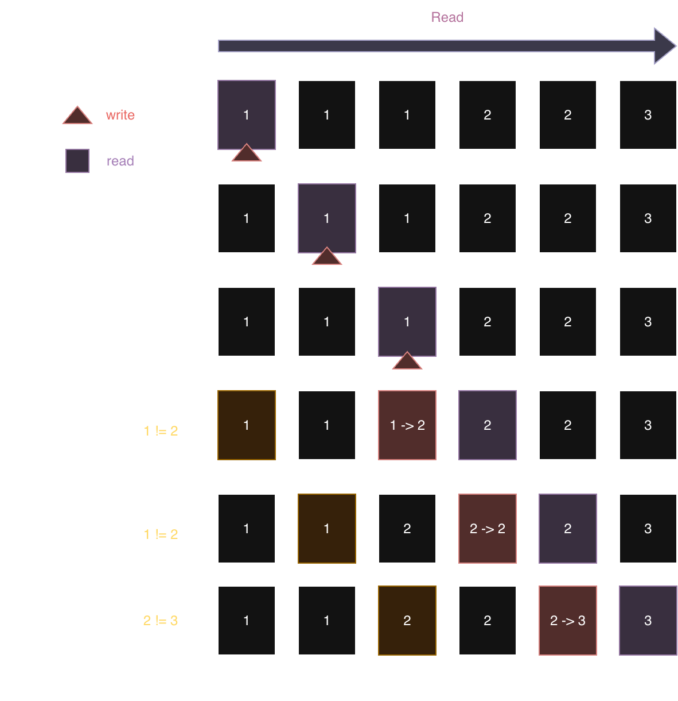

# Leetcode 80. Remove Duplicates from Sorted Array II



## Solution
```python
class Solution:
    def removeDuplicates(self, nums: List[int]) -> int:
        write = 0
        k = 2

        for read in range(len(nums)):
            
            if write < k or nums[write-k] != nums[read]:
                nums[write] = nums[read]
                write += 1
        
        return write
```


