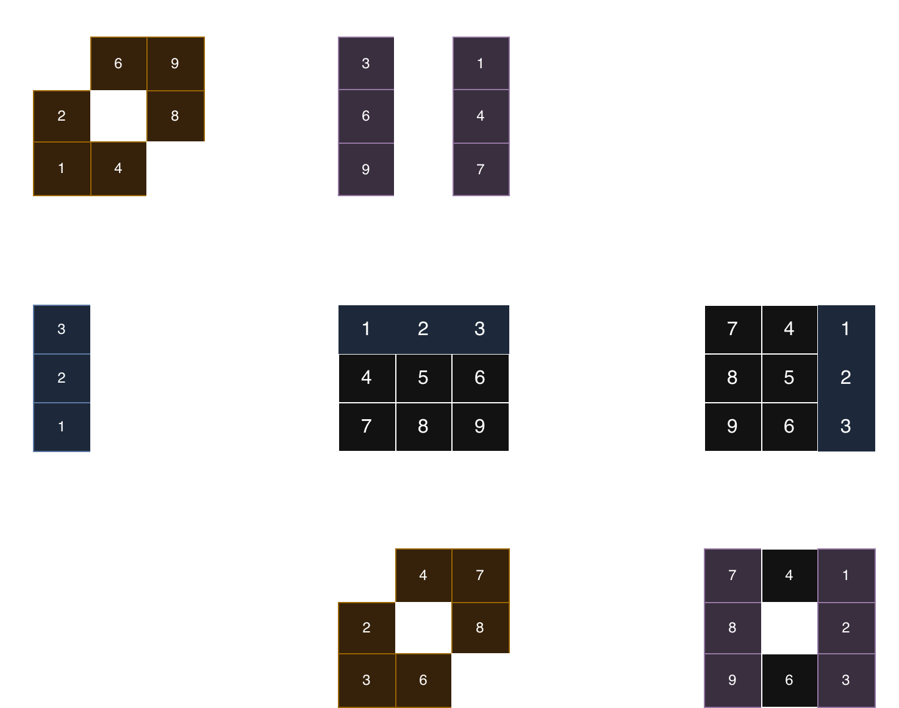

# 48. Rotate Image




## Line of thought
這題如果硬做會非常麻煩，因為要處理四個邊的旋轉，很容易寫錯 index。
但如果我們觀察矩陣旋轉的特性，會發現順時針旋轉 90 度其實可以拆解成兩個簡單的步驟：

1. **Transpose (轉置)**: 將矩陣沿著對角線翻轉，也就是 `matrix[i][j]` 和 `matrix[j][i]` 交換。
2. **Reverse (反轉)**: 將每一列 (Row) 的元素左右反轉。

舉例來說：
```
1 2 3
4 5 6
7 8 9
```

Step 1: Transpose
```
1 4 7
2 5 8
3 6 9
```

Step 2: Reverse each row
```
7 4 1
8 5 2
9 6 3
```
這樣就完成了順時針 90 度的旋轉，而且不需要額外的空間。

## Solution
### Time O(N^2), Space O(1)
```python
class Solution:
    def rotate(self, matrix: List[List[int]]) -> None:
        """
        Do not return anything, modify matrix in-place instead.
        """
        n = len(matrix)
        
        # 1. Transpose
        for i in range(n):
            for j in range(i + 1, n):
                matrix[i][j], matrix[j][i] = matrix[j][i], matrix[i][j]
        
        # 2. Reverse each row
        for i in range(n):
            matrix[i].reverse()
```

## 延伸 (Extension)
- **順時針旋轉 270 度** 等價於 **逆時針旋轉 90 度**。
- **逆時針旋轉 90 度** 的作法：先左右反轉 (Mirror) 再 Transpose。
