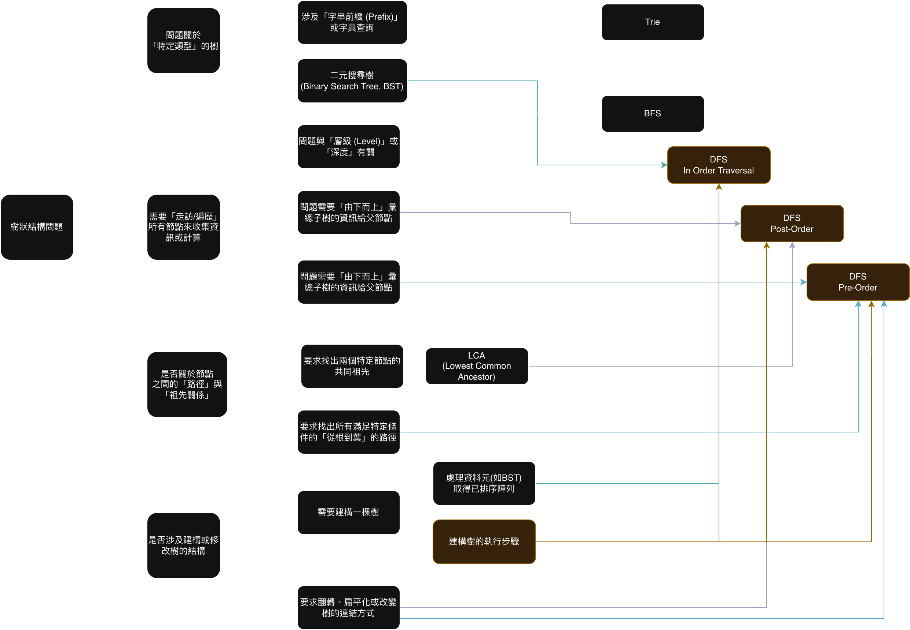
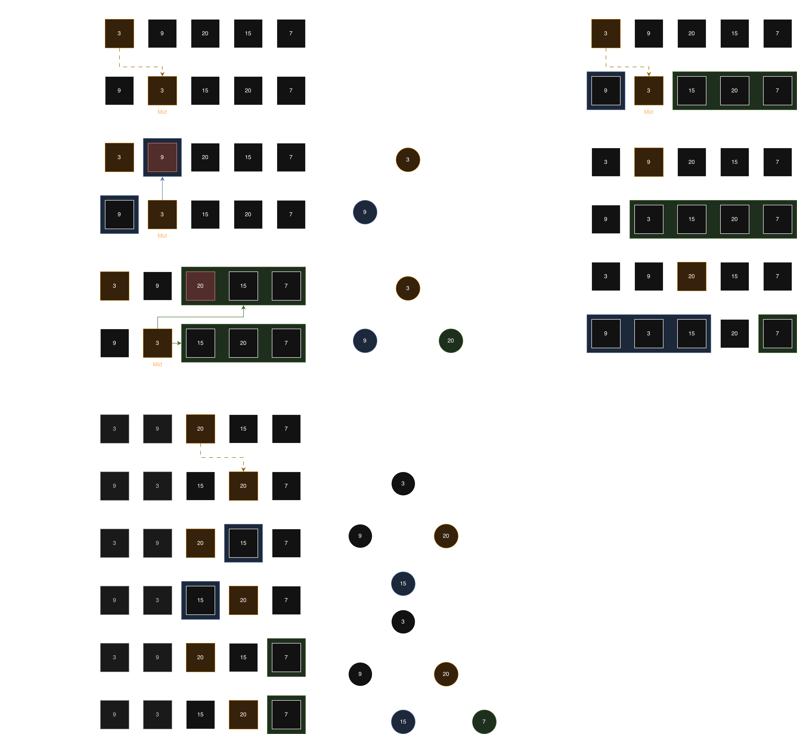

# Leetcode 105. Construct Binary Tree from Preorder and Inorder Traversal

## Classify

這題是一個樹問題，並且目標是建構一棵樹，因此可以快速的定義到建構樹的執行步驟，並且，我們知道要建構一個 binary tree, 必須要有一個 inorder 決定放置的位置(左右) 並透過 preorder/postorder 來決定哪個點是 root. 因此可能涉及的是樹常見的3種遍歷方式： `Inorder`, `PreOrder`, `PostOrder`.

## Line of thought


這題是使用 inorder 與 preorder 陣列來建立 binary tree 的基本題型，要記住的概念主要有兩點：
1. Preorder 是用來看「root」在哪裡的，根據 preorder 的順序： 父節點 -> 左節點 -> 右節點，我們可以知道，在 preorder 陣列中，第一個元素就是我們要找的 Tree 的 root.
2. Inorder 是用來決定「放哪邊」的，我們透過在 preorder 找到的 root, 透過遞迴的順序決定會是放在左邊或右邊. 


因此我們透過建立一個 inorder 的 map, 讓我們可以直接透過 root 的 val 定義到它在 inorder 中的位置，從而可以決定下一個 build 的區間範圍。 
並且我們使用一個變數 root_index, 來記錄在 preoder 順序時，root 移動到哪個位置
而我們 build 的函式則可以定義為輸入是 l 與 r, 代表從該區間`[l, r]`中，建立一個新的 root 節點，並決定好其 left 與 right 節點. 

在 `build` 函式中，必須先遞迴建立左子樹 (root.left)，再建立右子樹 (root.right). 這是因為 `root_index` 是依賴 `Preorder` 的 [根, (左子樹), (右子樹)] 順序來依序消耗節點的。`root.left` 的呼叫會負責消耗掉所有 `preorder` 陣列中屬於左子樹的節點，之後 `root_index` 才會剛好指向右子樹的開頭.


## Solutions
### 1\. Time $O(N^2)$, Space $O(N^2)$
```python
class Solution:
    def buildTree(self, preorder: List[int], inorder: List[int]) -> Optional[TreeNode]:
        if not preorder or not inorder:
            return None

        root_val = preorder[0]
        root = TreeNode(root_val)
        mid = inorder.index(root_val)

        root.left = self.buildTree(preorder[1 : 1 + mid], inorder[0 : mid])
        root.right = self.buildTree(preorder[1 + mid :], inorder[1+mid:])

        return root
```

### 2\. Time $O(N)$, Space $O(N)$
```python
class Solution:
    def buildTree(self, preorder: List[int], inorder: List[int]) -> Optional[TreeNode]:            
        inorder_map = {val: i for i, val in enumerate(inorder)}             
        self.root_idx = 0        
        
        def build(l, r):            
            if l > r:
                return None
            
            root_val = preorder[self.root_idx]
            root = TreeNode(root_val)
                        
            self.root_idx += 1
                        
            # 父 -> 左 -> 右
            mid = inorder_map[root_val]
            root.left = build(l, mid - 1)
            root.right = build(mid + 1, r)
            
            return root

        
        return build(0, len(inorder) - 1)
```