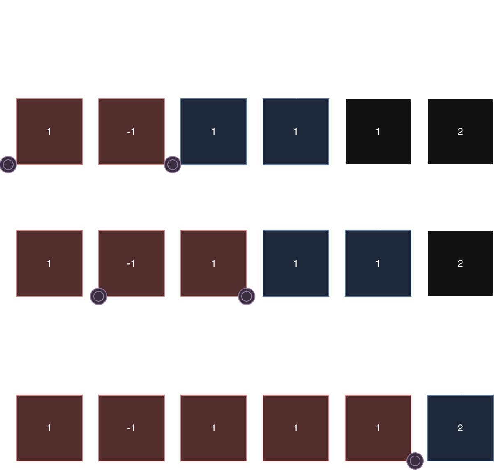

# Leetcode 560. Subarray Sum Equals K  



## Solution
```python
class Solution:
    def subarraySum(self, nums: List[int], k: int) -> int:
        prefixSum = { 0: 1}
        curr_sum, count = 0, 0

        # PrefixSum 是用來找出哪些合法點可以用來裁切

        for n in nums:
            curr_sum += n
            diff = curr_sum - k
            
            count += prefixSum.get(diff, 0)
            
            # prefixSum ++
            prefixSum[curr_sum] = prefixSum.get(curr_sum, 0) + 1

        return count
```        


要理解上面的解法，我們必須先了解到 prefixSum 的 Count 的意義是什麼，
事實上 prefixSum 對應到了下圖中，哪些合法點可以用來裁切完整的 nums 陣列。
計算 Current Sum 與 PrefixSum 的差距，代表我們要找到是否有 Prefix Array 的總和正好等同於這個差距，而透過 for loop 建立的 counter, 正代表在 current Index 時，有幾個 Prefix Array 的總和等同於一個數值
然後我們就可以透過從 prefixSum 這個 hashmap 中取出 count 並加到答案中
